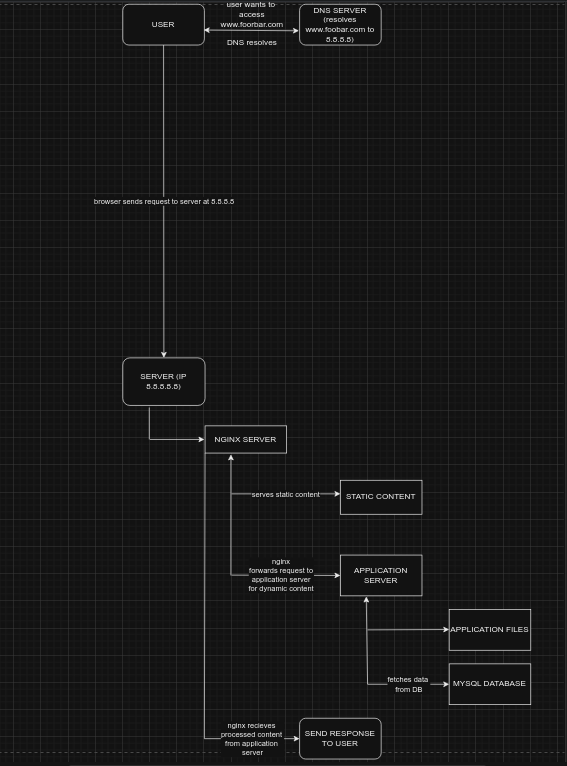
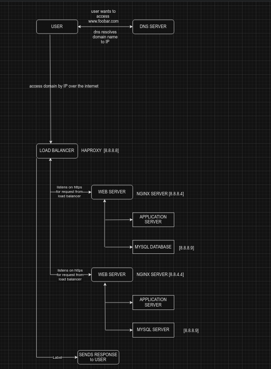

### 0x09. Web infrastructure design
This project focuses on building the infrastructure of a website. The primary focus is functionality and security. It delves into servers and their roles, the route taken when accessing a website by it's link and the idea of securing the website behind firewalls.

## Definition of terms
1. SERVER:
A physical or virtual machine that has the web application files or database files.
A common one is NGINX server, which serves relevant files based on query from the users browser.
2. DNS RESOLUTION:
when user sends request to DNS server to resolve a domain name (i.e: www.google.com)
the dns server returns to the browser the ip address associated with that domain name.
3. DOMAIN NAME:
human readeable address used to access websites on the internet
4. LOAD BALANCER:
Distributes incoming traffic between the servers
5. FIREWALL:
ENhances security by controling traffic between various parts of the infrastructure

# 0-simple_web_stack
WORK FLOW
1. DNS request
	user types the domain name and browser sends dns request to resolve the domain name
2. HTTP/HTTPS request:
	browser sends a request to the resolved IP
3. Web Server role:
	NGINX (in this case) serves the static content but forwards the request to application server
	to get the dynamic content
4. Application Server:
	Processes the request using the server-side scripts, may interact with MYSQL database
5. Database:
	respondes with stored data such as information, stored posts and other website content
6. Response to user:
	Nginx recieves processed content from application server and sends it back to user via http/https

# 1-distributed_web_infrastructure
WORK FLOW
- [Largely similar to the first one, only there is inclusion of a load balancer and servers are multiple]
the load balancer is introduced right before reaching the servers.
This ensures USER requests are distributed through the available servers(however many there are) as per a predefined algorithim, (i.e Round-Robin)
Extra servers are just webservers with the same structure, an application server and myswl database server

# 2-secured_and_monitored_web_infrastructure
WORK FLOW
- Aside from the inclusion of a load balancer to distribute the traffic, for security, a series of firewalls are strategically placed through out the architecture to ensure the system remains secure.
In the architecture below, there are 3 firewalls. One before accessing the load balancer, another before accessing the webservers and another right before accessing the database server.
There is also a monitering client to keep a log of the system to capture any errors and keep track of the systems health

## the images were drawn on draw.io
## Authors

This project is maintained by Emmanuel Odenyire Anyira and Austin Muthoni, both being students at ALX Africa, taking the ALX Software Engineering Program. Contributions to the project are welcomed via pull requests on GitHub.

For collaborations or inquiries;
Please contact Emmanuel Odenyire Anyira via:

- Email: eodenyire@gmail.com
- LinkedIn: Emmanuel Odenyire Anyira

You can contact Austin through:

- LinkedIn: Austin Ng'ang'a
- Email: trigger_austin00@proton.me
